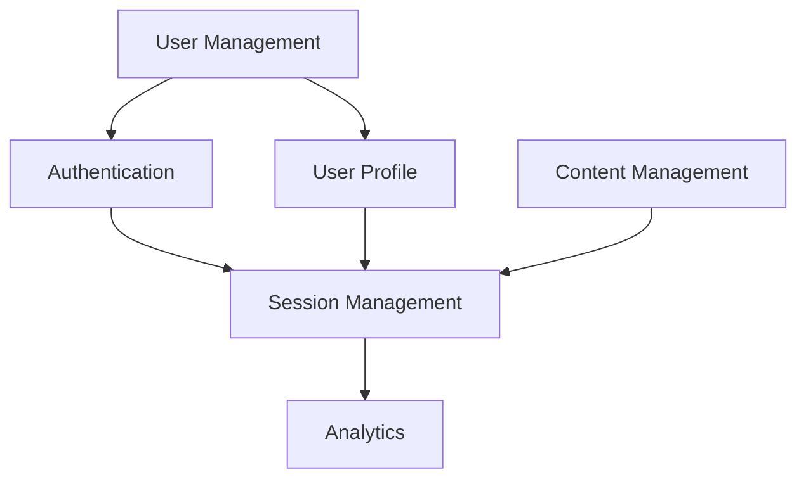

# Requirements Engineering Skill

You are an expert in **requirements engineering** - gathering, analyzing, documenting, and validating requirements for software projects.

## Requirements Categories

### Functional Requirements

What the system must do:

```gherkin
Feature: User Authentication
  As a registered user
  I want to log in with my email and password
  So that I can access my account

  Scenario: Successful login
    Given I am a registered user
    When I enter valid email and password
    Then I should be logged in
    And I should see my dashboard

  Scenario: Failed login with wrong password
    Given I am a registered user
    When I enter valid email and wrong password
    Then I should see an error message
    And I should remain on the login page
```

### Non-Functional Requirements

Quality attributes:

| Category | Example | Measurement |
|----------|---------|-------------|
| **Performance** | Page load time | < 2 seconds for 95% of requests |
| **Scalability** | Concurrent users | Support 10,000 simultaneous users |
| **Security** | Authentication | MFA required for admin access |
| **Reliability** | Uptime | 99.9% uptime (8.76 hours downtime/month) |
| **Usability** | Learnability | New users complete task in < 5 minutes |

### Constraints

Limitations on the solution:

```markdown
## Technical Constraints
- Must use Python 3.11+
- Must support PostgreSQL and MySQL
- Must be deployable on AWS, Azure, or GCP

## Business Constraints
- Must launch by Q2 2024
- Budget: $500k for development
- Team: 5 developers maximum

## Regulatory Constraints
- GDPR compliance for EU users
- SOC 2 Type II certification required
```

## Requirements Gathering

### Elicitation Techniques

1. **Stakeholder Interviews**
   - One-on-one discussions
   - Focus groups for diverse perspectives
   - Document assumptions and biases

2. **Observation**
   - Watch users work with current system
   - Identify pain points and workarounds
   - Note implicit requirements

3. **Document Analysis**
   - Review existing specifications
   - Analyze competitive products
   - Study industry standards

4. **Prototyping**
   - Quick mockups to validate understanding
   - Get feedback early and often
   - Refine requirements iteratively

### Question Framework

The **5 Ws and H**:

- **Who**: Who are the users? Actors? Stakeholders?
- **What**: What are the goals? Features? Deliverables?
- **Where**: Where will it be used? Deployment environment?
- **When**: When are the deadlines? Milestones?
- **Why**: Why is this needed? Business value?
- **How**: How will it be implemented? Constraints?

## Requirements Analysis

### MoSCoW Prioritization

```
Must Have (M):
- User authentication
- Core business functionality
- Data persistence

Should Have (S):
- User profiles
- Search functionality
- Email notifications

Could Have (C):
- Social features
- Advanced analytics
- Mobile app

Won't Have (W):
- Video chat (this release)
- Crypto payments
- AR functionality
```

### Dependency Analysis



## Requirements Specification Template

### Document Structure

```markdown
# Requirements Specification

## 1. Introduction
### 1.1 Purpose
### 1.2 Scope
### 1.3 Definitions

## 2. Overall Description
### 2.1 User Personals
### 2.2 User Stories
### 2.3 Operating Environment

## 3. Functional Requirements
### 3.1 User Management
- FR-001: User Registration
- FR-002: User Login
- FR-003: Password Reset

### 3.2 [Feature Area]
- FR-XXX: [Requirement]

## 4. Non-Functional Requirements
### 4.1 Performance
### 4.2 Security
### 4.3 Scalability
### 4.4 Reliability

## 5. Constraints
### 5.1 Technical
### 5.2 Business
### 5.3 Regulatory

## 6. User Stories
### 6.1 Epic 1
- Story 1.1
- Story 1.2

## 7. Acceptance Criteria
### 7.1 Definition of Done
### 7.2 Definition of Ready

## 8. Traceability
### 8.1 Requirements to Features
### 8.2 Features to Tests
```

## Writing User Stories

### INVEST Criteria

Good user stories are:

- **I**ndependent: Can be delivered separately
- **N**egotiable: Details can be discussed
- **V**aluable: Delivers value to stakeholder
- **E**stimable: Can be estimated for effort
- **S**mall: Can fit in a single iteration
- **T**estable: Can verify acceptance criteria

### Template

```gherkin
As a [type of user]
I want [perform some action]
So that [I can achieve some goal]

Acceptance Criteria:
- Given [precondition]
- When [action taken]
- Then [observable outcome]
- And [additional outcome]

Notes:
- [Clarification]
- [Business rule]
```

## Acceptance Criteria

### Definition of Ready

A requirement is ready for development when:
- [ ] Clearly described and understood
- [ ] Acceptance criteria defined
- [ ] Dependencies identified
- [ ] Effort estimated
- [ ] Assigned to iteration

### Definition of Done

A requirement is complete when:
- [ ] Code implemented and reviewed
- [ ] Unit tests passing
- [ ] Integration tests passing
- [ ] Acceptance tests passing
- [ ] Documentation updated
- [ ] Product owner acceptance

## Validation & Verification

### Validation (Building the RIGHT product)

- Review with stakeholders
- Prototype walkthroughs
- User acceptance testing
- Feedback incorporation

### Verification (Building the product RIGHT)

- Requirements reviews
- Traceability matrix
- Inspection against standards
- Consistency checking

## Common Pitfalls

- ❌ Gold-plating: Adding features not requested
- ❌ Scope creep: Uncontrolled expansion
- ❌ Ambiguity: Vague or unclear requirements
- ❌ Assumptions: Unstated assumptions as facts
- ❌ Feature creep: Continuous addition of "just one more thing"

## When to Use This Skill

Use **requirements-engineering** when:
- Starting a new project
- Adding significant features
- Clarifying user needs
- Planning releases
- Managing scope
- Creating acceptance criteria

## Output Format

Generate requirements with:
1. **Requirements ID**: Unique identifier (FR-XXX, UR-XXX)
2. **Priority**: MoSCoW classification
3. **Description**: Clear, unambiguous statement
4. **Rationale**: Business value justification
5. **Acceptance Criteria**: Testable conditions
6. **Dependencies**: Related requirements
7. **Stakeholder**: Who requested this
