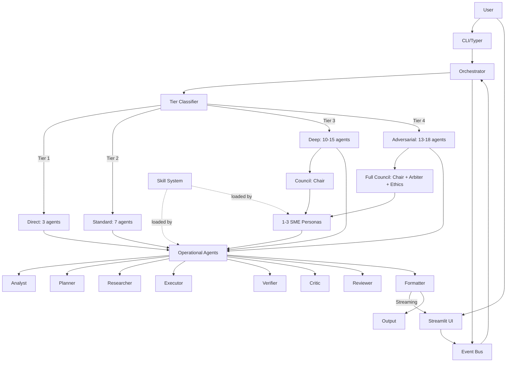

# Multi-Agent Reasoning System

A sophisticated multi-agent reasoning system built with the Claude Agent SDK, featuring a three-tier architecture (Council + Operational Agents + Dynamic SMEs), complexity-based routing, adversarial verification, and self-play debate capabilities.

## Architecture Overview



## Features

- **15 Permanent Agents**: 3 Council + 12 Operational
- **10+ Dynamic SME Personas**: On-demand domain experts
- **Four-Tier Complexity Routing**: From simple (3 agents) to adversarial (18 agents)
- **Eight-Phase Execution Pipeline**: Structured workflow with Council consultation
- **Self-Play Debate**: Multi-perspective reasoning with tiebreaker
- **5-Verdict Matrix**: Quality gate with PASS / PASS_WITH_CAVEATS / REVISE / REJECT / ESCALATE
- **5 Ensemble Patterns**: Pre-configured agent collaborations
- **Multi-Modal I/O**: Text, images, documents, code files
- **Cost Tracking**: Budget enforcement with real-time monitoring
- **Dual UI**: CLI (Typer) + Streamlit web interface
- **Event Bus**: Real-time agent lifecycle tracking with pub/sub event system
- **SDK-Aware Agent Methods**: Graceful fallback when the Claude Agent SDK is unavailable
- **Real Document Generation**: DOCX, XLSX, and PPTX output via python-docx, openpyxl, and python-pptx
- **Streaming Chat Responses**: Token-by-token streaming in the Streamlit chat interface
- **Configurable Skill Chains**: 4 built-in chains (full_development, research_and_report, code_review, documentation)
- **Per-Task Skill Override**: Override default skill selection on a per-task basis

## Key Components

- **Event Bus** (`src/core/events.py`) -- Pub/sub event system that broadcasts agent lifecycle events (start, progress, completion, error) so the UI and other listeners can react in real time.
- **SDK Integration** (`src/core/sdk_integration.py`) -- Wrapper layer that detects the Claude Agent SDK at runtime and falls back to direct API calls when the SDK is not installed, keeping the system portable.
- **Skill System** (`.claude/skills/`) -- Seven domain skills (requirements-engineering, architecture-design, code-generation, test-case-generation, document-creation, web-research, multi-agent-reasoning) loaded on demand by agents and SMEs.
- **Verdict Matrix** -- Five-verdict quality gate used by the Reviewer and Quality Arbiter: PASS, PASS_WITH_CAVEATS, REVISE, REJECT, ESCALATE. A REVISE verdict triggers automatic re-execution of the pipeline.
- **Streaming Chat** (`src/ui/pages/chat.py`) -- Streamlit chat page that streams responses token-by-token, displays agent activity via the Event Bus, and supports file upload/download.

## Agent Roster

### Strategic Council (Tier 3-4 only)

| Agent | Role | Model |
|-------|------|-------|
| Domain Council Chair | SME selection & governance | Opus |
| Quality Arbiter | Quality standard setting & tiebreaker | Opus |
| Ethics & Safety Advisor | Bias, PII, compliance review | Opus |

### Operational Agents

| Agent | Role | Model |
|-------|------|-------|
| Orchestrator | Parent agent, tier classification, coordination | Opus |
| Task Analyst | Task decomposition & requirements analysis | Sonnet |
| Planner | Execution planning & sequencing | Sonnet |
| Clarifier | Question formulation for missing requirements | Sonnet |
| Researcher | Evidence gathering & web research | Sonnet |
| Executor | Solution generation with Tree of Thoughts | Sonnet |
| Code Reviewer | Security, performance, style review | Sonnet |
| Formatter | Multi-format output generation | Sonnet |
| Verifier | Hallucination detection & fact-checking | Opus |
| Critic | Adversarial attack (5 vectors) | Opus |
| Reviewer | Final quality gate | Opus |
| Memory Curator | Knowledge extraction & persistence | Sonnet |

### Dynamic SME Personas (10 available)

| Persona | Domain | Skills |
|---------|--------|--------|
| IAM Architect | Identity & Access Management | SailPoint, CyberArk, RBAC |
| Cloud Architect | Cloud Infrastructure | Azure, AWS, GCP |
| Security Analyst | Security & Compliance | Threat modelling, OWASP |
| Data Engineer | Data Pipelines | ETL, databases, SQL |
| AI/ML Engineer | AI/ML Systems | GenAI, RAG, agents |
| Test Engineer | Testing Strategies | Test cases, SIT, UAT |
| Business Analyst | Requirements & Processes | BPMN, gap analysis |
| Technical Writer | Documentation | Docs, tenders, reports |
| DevOps Engineer | CI/CD & Infrastructure | Docker, Kubernetes, Terraform |
| Frontend Developer | UI Development | Streamlit, React, dashboards |

## Quick Start

### Prerequisites

- Python 3.10 or higher
- API key for your chosen LLM provider (Anthropic, OpenAI, Google, etc.)

### Installation

```bash
# Clone the repository
cd C:\Users\ksmuv\Downloads\Multi-Agent-Reasoning

# Create virtual environment
python -m venv venv
source venv/bin/activate  # On Windows: venv\Scripts\activate

# Install dependencies
pip install -e .

# Copy environment template
cp .env.example .env

# Edit .env and configure your LLM provider
```

### LLM Configuration

The system supports multiple LLM providers. Configure your preferred provider in `.env`:

```bash
# Choose your provider (anthropic, openai, google, mistral, cohere, together, custom)
MAS_LLM_PROVIDER=anthropic

# Add corresponding API key
ANTHROPIC_API_KEY=sk-ant-your-key-here
```

**Supported Providers:**
- **Anthropic (Claude)** - Default, best for complex reasoning
- **OpenAI (GPT)** - `MAS_LLM_PROVIDER=openai`
- **Google (Gemini)** - `MAS_LLM_PROVIDER=google`
- **Azure OpenAI** - `MAS_LLM_PROVIDER=azure_openai`
- **Mistral AI** - `MAS_LLM_PROVIDER=mistral`
- **Cohere** - `MAS_LLM_PROVIDER=cohere`
- **Together AI** - `MAS_LLM_PROVIDER=together`
- **Custom/OpenAI-compatible** - `MAS_LLM_PROVIDER=custom` (for Ollama, vLLM, etc.)

📖 **See [docs/llm-configuration.md](docs/llm-configuration.md) for detailed configuration guide**

### CLI Usage

```bash
# Single query
mas query "Write a Python hello world function"

# Interactive chat
mas chat

# With options
mas query "Analyze this code" --file main.py --verbose --tier 3 --format markdown
```

### Streamlit UI

```bash
streamlit run src/ui/app.py
```

The Streamlit interface includes the following pages:

- **Chat** -- Streaming chat with token-by-token responses, file upload/download, and inline agent status
- **Agent Activity Panel** -- Real-time agent lifecycle view powered by the Event Bus
- **Cost Dashboard** -- Live cost tracking with per-agent and per-session breakdowns
- **Debate Viewer** -- Colour-coded self-play debate positions with tiebreaker results
- **Skill Catalogue** -- Browse and inspect the available skills and skill chains
- **SME Persona Browser** -- View all registered SME personas, their domains, and trigger keywords
- **Settings Panel** -- Configure LLM provider, budget, tier overrides, and logging
- **File Upload/Download** -- Attach files to queries and download generated documents (DOCX, XLSX, PPTX)

## Configuration

### Quick Setup

1. Copy `.env.example` to `.env`
2. Set your LLM provider: `MAS_LLM_PROVIDER=anthropic`
3. Add your API key: `ANTHROPIC_API_KEY=sk-ant-xxxxx`

### Key Environment Variables

```bash
# LLM Provider Selection
MAS_LLM_PROVIDER=anthropic          # Provider: anthropic, openai, google, etc.

# API Keys (set the one for your provider)
ANTHROPIC_API_KEY=sk-ant-xxxxx      # For Anthropic/Claude
OPENAI_API_KEY=sk-xxxxx             # For OpenAI/GPT
GOOGLE_API_KEY=xxxxx                # For Google/Gemini
AZURE_OPENAI_API_KEY=xxxxx          # For Azure OpenAI
MISTRAL_API_KEY=xxxxx               # For Mistral
COHERE_API_KEY=xxxxx                # For Cohere
TOGETHER_API_KEY=xxxxx              # For Together AI

# Budget Control
MAS_MAX_BUDGET=5.00                 # Maximum session budget in USD

# Agent Configuration
MAS_MAX_TURNS_ORCHESTRATOR=200      # Max turns for orchestrator
MAS_MAX_TURNS_SUBAGENT=30           # Max turns for subagents
MAS_MAX_SME_COUNT=3                 # Max SME personas to spawn

# Logging
MAS_LOG_LEVEL=INFO                  # DEBUG, INFO, WARN, ERROR
```

### Model Override

Override default models for specific agents:

```bash
MAS_ORCHESTRATOR_MODEL=claude-3-5-opus-20240507
MAS_ANALYST_MODEL=claude-3-5-sonnet-20241022
MAS_CLARIFIER_MODEL=claude-3-5-haiku-20241022
```

📖 **See [docs/config-quick-reference.md](docs/config-quick-reference.md) for provider-specific model mappings**

## Project Structure

```
multi-agent-system/
├── src/
│   ├── agents/              # All agent implementations
│   ├── core/                # Pipeline, complexity, verdict, debate, SME registry
│   │   ├── events.py        # Event Bus (pub/sub lifecycle events)
│   │   ├── sdk_integration.py # SDK wrapper with graceful fallback
│   │   ├── skill_chains     # 4 built-in skill chains
│   │   └── ...
│   ├── schemas/             # 13 Pydantic models
│   ├── tools/               # Custom MCP tools
│   ├── cli/                 # Typer CLI
│   ├── ui/                  # Streamlit app (chat, activity, cost, debate)
│   └── utils/               # Logging, cost tracking
├── .claude/skills/          # Agent skills (SKILL.md per domain)
│   ├── architecture-design/
│   ├── code-generation/
│   ├── document-creation/
│   ├── multi-agent-reasoning/
│   ├── requirements-engineering/
│   ├── test-case-generation/
│   └── web-research/
├── config/
│   ├── agents/              # Per-agent CLAUDE.md
│   └── sme/                 # SME persona templates
├── tests/
│   ├── unit/                # 500+ unit tests
│   └── integration/         # Integration tests (MAS_RUN_INTEGRATION gated)
└── docs/                    # Documentation + knowledge base
```

## Development

```bash
# Run tests
pytest

# Run with coverage
pytest --cov=src

# Format code
black src/ tests/

# Lint
ruff check src/ tests/

# Type check
mypy src/
```

## Testing

The project includes 500+ unit tests and a suite of integration tests.

### Unit Tests

There is at least one dedicated test file per agent, plus tests for core modules, schemas, and configuration:

```bash
# Run all unit tests
pytest tests/unit/

# Run tests for a specific agent
pytest tests/unit/test_analyst.py

# Run with coverage
pytest tests/unit/ --cov=src
```

### Integration Tests

Integration tests make live API calls and are gated behind an environment variable to avoid accidental cost:

```bash
# Enable and run integration tests
MAS_RUN_INTEGRATION=true pytest tests/integration/

# Run only integration tests for tier workflows
MAS_RUN_INTEGRATION=true pytest tests/integration/test_tier_workflows.py
```

By default `MAS_RUN_INTEGRATION` is `false` (set in `.env.example`), so `pytest` will skip integration tests unless you opt in.

### Full Suite

```bash
# Unit tests only (default, no API calls)
pytest

# Everything including integration
MAS_RUN_INTEGRATION=true pytest

# With verbose output and coverage
MAS_RUN_INTEGRATION=true pytest -v --cov=src --cov-report=term-missing
```

## Creating Custom SME Personas

To add a new SME persona:

1. Create a template file in `config/sme/your_persona.md`:
```yaml
---
persona: Your Persona Name
domain: Your Domain
trigger_keywords: [keyword1, keyword2, keyword3]
skill_files: [your-skill-name]
interaction_modes: [advisor, co-executor, debater]
default_model: sonnet
---

# Your Persona Name

You are a domain expert in [Your Domain]...
```

2. Register the persona in `src/core/sme_registry.py` by adding an entry to `SME_REGISTRY`.

3. (Optional) Create a matching skill in `.claude/skills/your-skill-name/SKILL.md`.

The system will auto-discover the persona via keyword matching during task analysis.

## Documentation

- **[LLM Configuration Guide](docs/llm-configuration.md)** - Complete guide for configuring LLM providers
- **[Configuration Quick Reference](docs/config-quick-reference.md)** - Quick reference for common providers
- **Functional Requirements**: `FRD_MultiAgent_Prototype_v4.docx`
- **Vibe Coding Prompts**: `docs/vibe-prompts.md`
- **Agent Configs**: `config/agents/*/CLAUDE.md`
- **SME Personas**: `config/sme/*.md`

## License

MIT

## Author

Kapardi - Version 4.0 | 7 March 2026
