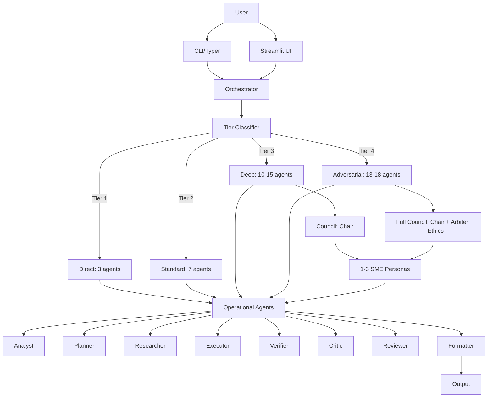

# Multi-Agent Reasoning System

A sophisticated multi-agent reasoning system built with the Claude Agent SDK, featuring a three-tier architecture (Council + Operational Agents + Dynamic SMEs), complexity-based routing, adversarial verification, and self-play debate capabilities.

## Architecture Overview



## Features

- **15 Permanent Agents**: 3 Council + 12 Operational
- **10+ Dynamic SME Personas**: On-demand domain experts
- **Four-Tier Complexity Routing**: From simple (3 agents) to adversarial (18 agents)
- **Eight-Phase Execution Pipeline**: Structured workflow with Council consultation
- **Self-Play Debate**: Multi-perspective reasoning with tiebreaker
- **Verdict Matrix**: Quality gate with automatic revision triggering
- **5 Ensemble Patterns**: Pre-configured agent collaborations
- **Multi-Modal I/O**: Text, images, documents, code files
- **Cost Tracking**: Budget enforcement with real-time monitoring
- **Dual UI**: CLI (Typer) + Streamlit web interface

## Agent Roster

### Strategic Council (Tier 3-4 only)

| Agent | Role | Model |
|-------|------|-------|
| Domain Council Chair | SME selection & governance | Opus |
| Quality Arbiter | Quality standard setting & tiebreaker | Opus |
| Ethics & Safety Advisor | Bias, PII, compliance review | Opus |

### Operational Agents

| Agent | Role | Model |
|-------|------|-------|
| Orchestrator | Parent agent, tier classification, coordination | Opus |
| Task Analyst | Task decomposition & requirements analysis | Sonnet |
| Planner | Execution planning & sequencing | Sonnet |
| Clarifier | Question formulation for missing requirements | Sonnet |
| Researcher | Evidence gathering & web research | Sonnet |
| Executor | Solution generation with Tree of Thoughts | Sonnet |
| Code Reviewer | Security, performance, style review | Sonnet |
| Formatter | Multi-format output generation | Sonnet |
| Verifier | Hallucination detection & fact-checking | Opus |
| Critic | Adversarial attack (5 vectors) | Opus |
| Reviewer | Final quality gate | Opus |
| Memory Curator | Knowledge extraction & persistence | Sonnet |

### Dynamic SME Personas (10 available)

| Persona | Domain | Skills |
|---------|--------|--------|
| IAM Architect | Identity & Access Management | SailPoint, CyberArk, RBAC |
| Cloud Architect | Cloud Infrastructure | Azure, AWS, GCP |
| Security Analyst | Security & Compliance | Threat modelling, OWASP |
| Data Engineer | Data Pipelines | ETL, databases, SQL |
| AI/ML Engineer | AI/ML Systems | GenAI, RAG, agents |
| Test Engineer | Testing Strategies | Test cases, SIT, UAT |
| Business Analyst | Requirements & Processes | BPMN, gap analysis |
| Technical Writer | Documentation | Docs, tenders, reports |
| DevOps Engineer | CI/CD & Infrastructure | Docker, Kubernetes, Terraform |
| Frontend Developer | UI Development | Streamlit, React, dashboards |

## Quick Start

### Prerequisites

- Python 3.10 or higher
- API key for your chosen LLM provider (Anthropic, OpenAI, Google, etc.)

### Installation

```bash
# Clone the repository
cd C:\Users\ksmuv\Downloads\Multi-Agent-Reasoning

# Create virtual environment
python -m venv venv
source venv/bin/activate  # On Windows: venv\Scripts\activate

# Install dependencies
pip install -e .

# Copy environment template
cp .env.example .env

# Edit .env and configure your LLM provider
```

### LLM Configuration

The system supports multiple LLM providers. Configure your preferred provider in `.env`:

```bash
# Choose your provider (anthropic, openai, google, mistral, cohere, together, glm, custom)
MAS_LLM_PROVIDER=anthropic

# Add corresponding API key
ANTHROPIC_API_KEY=sk-ant-your-key-here
```

**Supported Providers:**
- **Anthropic (Claude)** - Default, best for complex reasoning
- **OpenAI (GPT)** - `MAS_LLM_PROVIDER=openai`
- **Google (Gemini)** - `MAS_LLM_PROVIDER=google`
- **Azure OpenAI** - `MAS_LLM_PROVIDER=azure_openai`
- **Mistral AI** - `MAS_LLM_PROVIDER=mistral`
- **Cohere** - `MAS_LLM_PROVIDER=cohere`
- **Together AI** - `MAS_LLM_PROVIDER=together`
- **GLM (Zhipu AI)** - `MAS_LLM_PROVIDER=glm` (GLM-4 models)
- **Custom/OpenAI-compatible** - `MAS_LLM_PROVIDER=custom` (for Ollama, vLLM, etc.)

📖 **See [docs/llm-configuration.md](docs/llm-configuration.md) for detailed configuration guide**

## 🚀 CLI Quick Start Guide

### Step 1: Navigate to the Repository

```powershell
# PowerShell
cd C:\Users\ksmuv\Downloads\UAT_MultiAgent_Reasoning\repo

# Or from the parent directory
cd .\repo
```

### Step 2: Activate the Virtual Environment

```powershell
# Windows PowerShell
.\venv\Scripts\Activate.ps1

# Or use Python directly
.\venv\Scripts\python.exe --version
```

### Step 3: Verify Installation

```powershell
# Check if dependencies are installed
.\venv\Scripts\python.exe -c "import src; print('OK')"

# Show CLI version
.\venv\Scripts\python.exe -m src.cli.main version
```

### Step 4: Run CLI Commands

#### **Basic Query**
```powershell
.\venv\Scripts\python.exe -m src.cli.main query "What is the capital of France?"
```

#### **Interactive Chat Mode**
```powershell
.\venv\Scripts\python.exe -m src.cli.main chat
# Then type your questions and type 'exit' to quit
```

#### **Show System Status**
```powershell
.\venv\Scripts\python.exe -m src.cli.main status
```

#### **Analyze a Task**
```powershell
.\venv\Scripts\python.exe -m src.cli.main analyze "Write a Python REST API"
```

#### **List Available SME Personas**
```powershell
.\venv\Scripts\python.exe -m src.cli.main personas list
```

#### **List Ensemble Patterns**
```powershell
.\venv\Scripts\python.exe -m src.cli.main ensembles
```

### Step 5: Common Commands Reference

| Command | Description | Example |
|---------|-------------|---------|
| `query` | Execute a query | `mas query "Your question"` |
| `chat` | Interactive chat mode | `mas chat` |
| `analyze` | Analyze task complexity | `mas analyze "Your task"` |
| `status` | Show system status | `mas status` |
| `ensembles` | List ensemble patterns | `mas ensembles` |
| `personas` | Browse SME personas | `mas personas list` |
| `tools` | List available tools | `mas tools` |
| `sessions` | Manage sessions | `mas sessions list` |
| `version` | Show version info | `mas version` |

### Advanced Usage

#### **Query with Specific Tier**
```powershell
.\venv\Scripts\python.exe -m src.cli.main query "Explain quantum computing" --tier 3
```

#### **Query with File Attachment**
```powershell
.\venv\Scripts\python.exe -m src.cli.main query "Analyze this code" --file main.py
```

#### **Save Output to File**
```powershell
.\venv\Scripts\python.exe -m src.cli.main query "What is AI?" --file output.txt
```

#### **Verbose Output**
```powershell
.\venv\Scripts\python.exe -m src.cli.main query "Your question" --verbose
```

## 📋 Troubleshooting

### CLI Shows "Insufficient balance" Error

**Error**: `余额不足或无可用资源包,请充值。` (Insufficient balance)

**Solution**: Top up your GLM account at https://open.bigmodel.cn/

### CLI Hangs or Freezes

**Solution**: The CLI has been fixed! If you still see issues:
1. Make sure you're using the latest code: `git pull`
2. Check your API key in `.env`
3. Try: `.\venv\Scripts\python.exe -m src.cli.main status`

### Module Not Found Errors

**Solution**: Reinstall dependencies
```powershell
.\venv\Scripts\python.exe -m pip install -e .
```

### Connection Errors

**Solution**: Check your internet connection and API key validity

### Unicode/Encoding Errors

**Solution**: The CLI now handles Unicode correctly. If you see issues, update:
```powershell
git pull
.\venv\Scripts\python.exe -m pip install -e .
```

## 🌐 Web Interface (Streamlit)

```powershell
# Start the Streamlit server
.\venv\Scripts\python.exe -m streamlit run src/ui/app.py

# Access at: http://localhost:8501
```

## 📚 Additional Resources

- **[LLM Configuration Guide](docs/llm-configuration.md)** - Configure different LLM providers
- **[Configuration Quick Reference](docs/config-quick-reference.md)** - All environment variables
- **Session Management**: `.claude/sessions/` - View past conversation history

### Streamlit UI

```bash
streamlit run src/ui/app.py
```

## Configuration

### Quick Setup

1. Copy `.env.example` to `.env`
2. Set your LLM provider: `MAS_LLM_PROVIDER=anthropic`
3. Add your API key: `ANTHROPIC_API_KEY=sk-ant-xxxxx`

### Key Environment Variables

```bash
# LLM Provider Selection
MAS_LLM_PROVIDER=anthropic          # Provider: anthropic, openai, google, etc.

# API Keys (set the one for your provider)
ANTHROPIC_API_KEY=sk-ant-xxxxx      # For Anthropic/Claude
OPENAI_API_KEY=sk-xxxxx             # For OpenAI/GPT
GOOGLE_API_KEY=xxxxx                # For Google/Gemini
AZURE_OPENAI_API_KEY=xxxxx          # For Azure OpenAI
MISTRAL_API_KEY=xxxxx               # For Mistral
COHERE_API_KEY=xxxxx                # For Cohere
TOGETHER_API_KEY=xxxxx              # For Together AI
GLM_API_KEY=xxxxx                   # For Zhipu AI/GLM

# Budget Control
MAS_MAX_BUDGET=5.00                 # Maximum session budget in USD

# Agent Configuration
MAS_MAX_TURNS_ORCHESTRATOR=200      # Max turns for orchestrator
MAS_MAX_TURNS_SUBAGENT=30           # Max turns for subagents
MAS_MAX_SME_COUNT=3                 # Max SME personas to spawn

# Logging
MAS_LOG_LEVEL=INFO                  # DEBUG, INFO, WARN, ERROR
```

### Model Override

Override default models for specific agents:

```bash
MAS_ORCHESTRATOR_MODEL=claude-3-5-opus-20240507
MAS_ANALYST_MODEL=claude-3-5-sonnet-20241022
MAS_CLARIFIER_MODEL=claude-3-5-haiku-20241022
```

📖 **See [docs/config-quick-reference.md](docs/config-quick-reference.md) for provider-specific model mappings**

## Project Structure

```
multi-agent-system/
├── src/
│   ├── agents/          # All agent implementations
│   ├── core/            # Pipeline, complexity, verdict, debate, SME registry
│   ├── schemas/         # 13 Pydantic models
│   ├── tools/           # Custom MCP tools
│   ├── cli/             # Typer CLI
│   ├── ui/              # Streamlit app
│   └── utils/           # Logging, cost, events
├── .claude/skills/      # Agent skills (SKILL.md)
├── config/
│   ├── agents/          # Per-agent CLAUDE.md
│   └── sme/             # SME persona templates
├── tests/               # Unit + integration tests
└── docs/                # Documentation + knowledge base
```

## Development

```bash
# Run tests
pytest

# Run with coverage
pytest --cov=src

# Format code
black src/ tests/

# Lint
ruff check src/ tests/

# Type check
mypy src/
```

## Creating Custom SME Personas

To add a new SME persona:

1. Create a template file in `config/sme/your_persona.md`:
```yaml
---
persona: Your Persona Name
domain: Your Domain
trigger_keywords: [keyword1, keyword2, keyword3]
skill_files: [your-skill-name]
interaction_modes: [advisor, co-executor, debater]
default_model: sonnet
---

# Your Persona Name

You are a domain expert in [Your Domain]...
```

2. Register the persona in `src/core/sme_registry.py` by adding an entry to `SME_REGISTRY`.

3. (Optional) Create a matching skill in `.claude/skills/your-skill-name/SKILL.md`.

The system will auto-discover the persona via keyword matching during task analysis.

## Documentation

- **[LLM Configuration Guide](docs/llm-configuration.md)** - Complete guide for configuring LLM providers
- **[Configuration Quick Reference](docs/config-quick-reference.md)** - Quick reference for common providers
- **Functional Requirements**: `FRD_MultiAgent_Prototype_v4.docx`
- **Vibe Coding Prompts**: `docs/vibe-prompts.md`
- **Agent Configs**: `config/agents/*/CLAUDE.md`
- **SME Personas**: `config/sme/*.md`

## License

MIT

## Author

Kapardi - Version 4.0 | 7 March 2026
